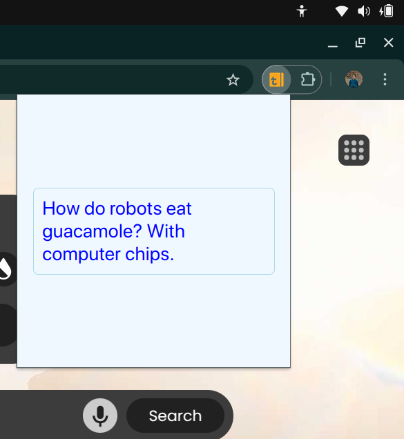
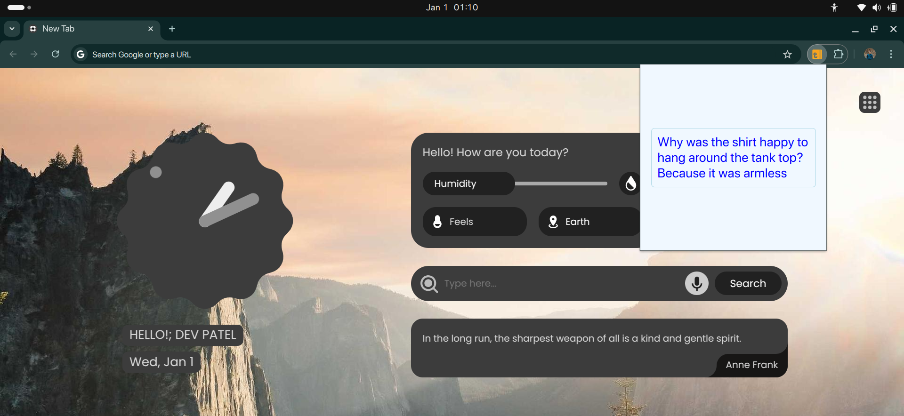

# Random Joke Chrome Extension

A simple Chrome extension that brings a smile to your face by showing a random joke every time you open it. Built with HTML, CSS, and JavaScript.

## Features

- Displays a random joke whenever the extension is opened.
- Clean and user-friendly interface.
- Lightweight and fast.

## Technologies Used

- **HTML**: For structuring the extension popup.
- **CSS**: For styling the user interface.
- **JavaScript**: For fetching and displaying random jokes.

## Installation

1. Clone this repository or download it as a ZIP file:
   ```bash
   git clone https://github.com/Dev2139/Random-Joke-Extension.git
   ```

2. Open Google Chrome and navigate to `chrome://extensions/`.

3. Enable **Developer Mode** in the top-right corner.

4. Click **Load unpacked** and select the folder containing the extension files.

5. The extension will now be added to Chrome, and its icon will appear in the extensions bar.
   (I made a file Explaination.md which gives Detailed explaination how to deploy an Extension to the Chrome Web Store)

## Usage

1. Click on the extension icon in the Chrome toolbar.
2. A random joke will be displayed in the popup.
3. Laugh and enjoy your day!

4. ## Screenshots





5. ## Working Explaination

[](Working.mp4)


## Contributing

Contributions are welcome! Feel free to open an issue or submit a pull request.

---

Made with ❤️ to brighten your day!
